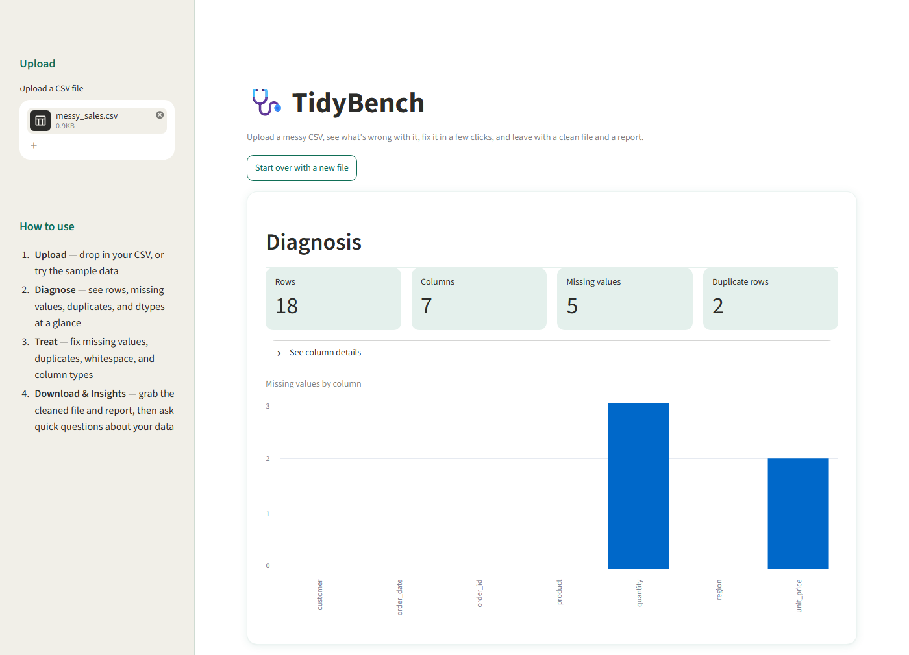

# 🩺 TidyBench

Upload a messy CSV, see exactly what's wrong with it, fix it in a few clicks, and leave with a clean file plus a plain-English report of what changed.



## Why

Real-world spreadsheets are rarely clean. They have duplicate rows, half-filled columns, inconsistent text and wrong data types. TidyBench automates the first, most repetitive hour of any data task: figuring out what's wrong before you can do anything useful with it.

## Features

- **Diagnose:** rows, columns, missing values, duplicates and data types at a glance
- **Treat:** fill missing values (mean, median, mode or a custom value) or drop them, remove duplicates, strip stray whitespace, and convert column types, all from the UI
- **Report:** a before-and-after summary of everything that changed, downloadable as Markdown alongside the cleaned CSV
- **Quick Insights:** once the data is clean, pick a preset question (top category by total, average, highest or lowest value) and get a plain-English answer

## Quickstart

```bash
git clone https://github.com/rushilcodes23/TidyBench.git
cd TidyBench
pip install -r requirements.txt
streamlit run app.py
```

Upload your own CSV, or try the included `sample_data/messy_sales.csv`. It has duplicate rows, missing values, inconsistent casing and one obvious outlier built in.

Last tested in September 2026 with Python 3.13, pandas 3.0 and Streamlit 1.60.

## How it's organised

```
TidyBench/
├── app.py               # Streamlit UI
├── cleaning.py          # pandas/numpy logic, no Streamlit dependency
├── test_cleaning.py     # checks for cleaning.py against the sample data
├── requirements.txt
├── sample_data/
│   └── messy_sales.csv
└── .streamlit/
    └── config.toml      # app theme
```

`cleaning.py` has no Streamlit import, so the logic can be tested and reused on its own. Run `python test_cleaning.py` to check it against the sample data.

## Techniques used

- Reading and inspecting data: `read_csv`, `.shape`, `.dtypes`, `.isnull()`, `.duplicated()`
- Cleaning: `.fillna()`, `.dropna()`, `.drop_duplicates()`, `.astype()`, `.str.strip()`
- numpy: `np.percentile` for IQR-based outlier bounds
- Streamlit: session state, tabs, columns, metrics, download buttons
- pandas 3.0 changed the default type for text columns from `object` to a dedicated `str` type, so text columns are detected with `pd.api.types.is_string_dtype()`, which works on both versions

## Roadmap

`cleaning.py` already has a tested `find_outliers_iqr()` function that isn't wired into the UI yet. That's the next feature. After that:

- [ ] Outlier tab: flag rows with `find_outliers_iqr`, then drop or cap them
- [ ] Treat inconsistent categories as one value (e.g. "NY" / "New York" / "ny")
- [ ] Handle mixed date formats within a single column
- [ ] Strip currency symbols and commas from numbers stored as text (e.g. `"$1,200"`)
- [ ] Clean up column names (spaces to underscores, consistent casing)
- [ ] Support multi-sheet Excel uploads
- [ ] Catch near-duplicates, not just exact ones
- [ ] Export the summary report as a PDF

## About

An early project (July 2026) by [Rushil A. Bajpai](https://github.com/rushilcodes23). I now run [Ru Visibility](https://ruvisibility.com), an SEO and AI visibility (GEO) consultancy.

## License

MIT. See [LICENSE](LICENSE).
